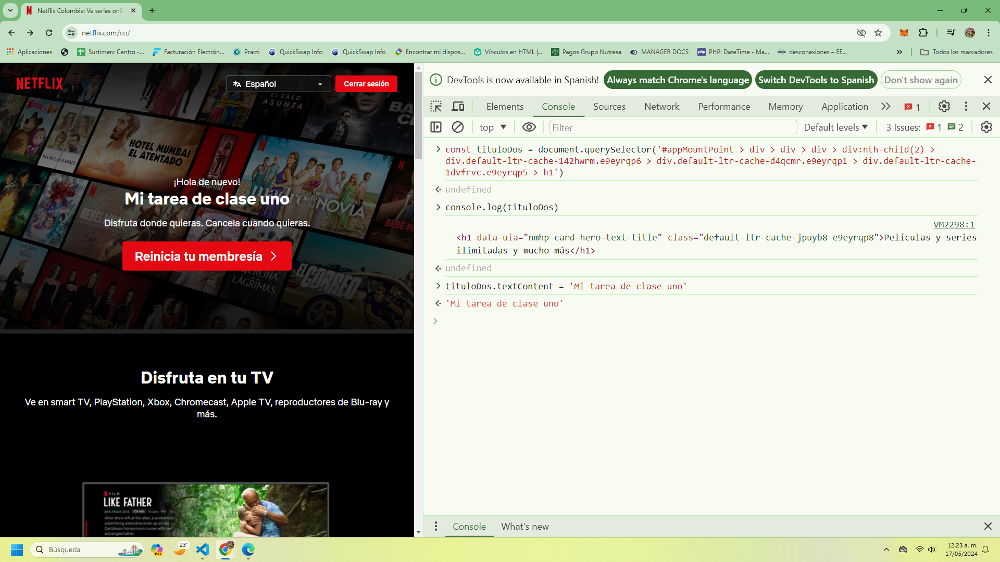

# Repositorio MODULO_CUATRO_JORGE_TONGUINO.

# Clase uno.

1. 
# a 

Seleciono el titulo o parafo a cambiar con click derecho y le doy inspecionar.

 Titulo Netflix;

# b

En element selecciono el h1 o caja contenedora doy click derecho en copy, copy selector.

 copy selector.

# c 
Habro la consola del navegador y creo una cosnt "membresiaDos" y le asigno el h1 que contiene la informacion del titulo a modificar.

 comandos de modoficacion a titulo "Mi tarea de clase uno"

# b
Mi segundo ejercicio desde el pasoa paso con una cosnt "membresia".

2. 

# a 

Se extrae los primero 20 pokemones tomando la practica de potsman.
[los Primero 20 pokemones](losPrimero20Pokemones.json)

# a 

Se extrae del 100 a 120 pokemones tomando la practica de 
[De 100 a 120 pokemones](de100A120Pokemones.json.json)

